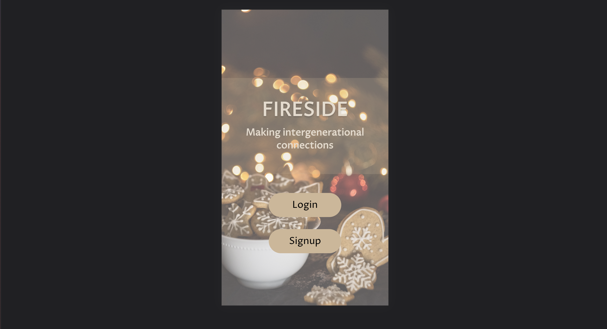
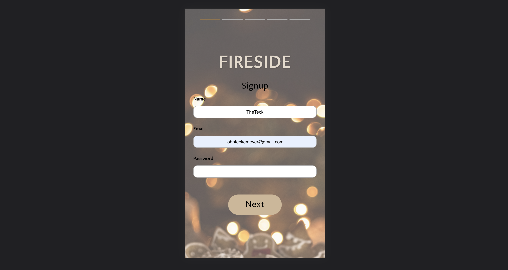
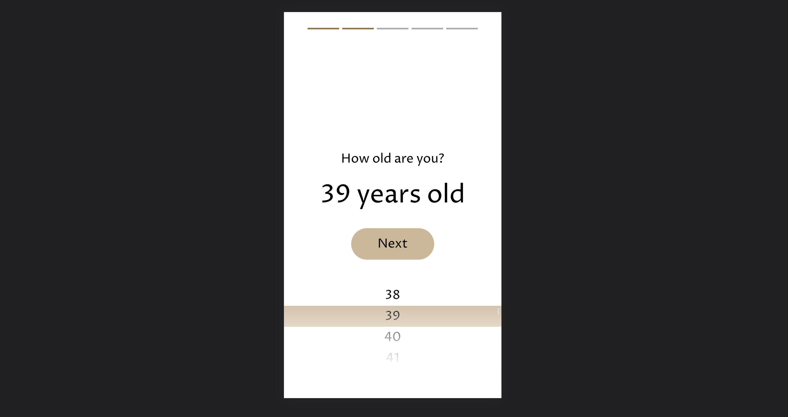
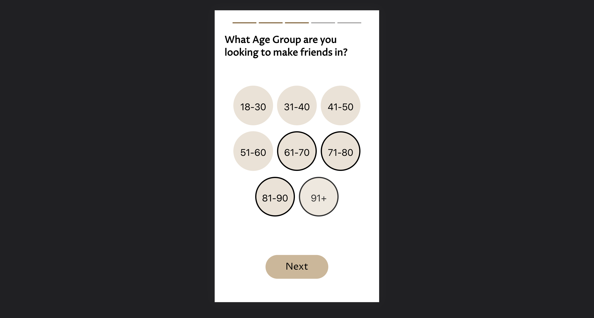
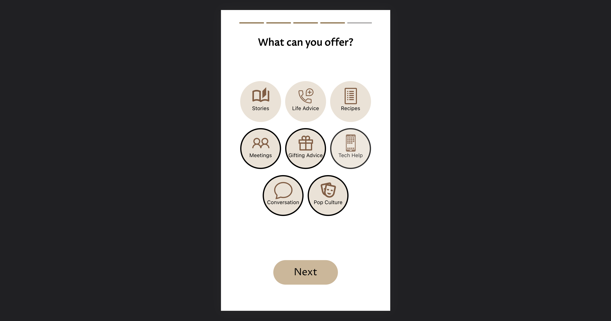
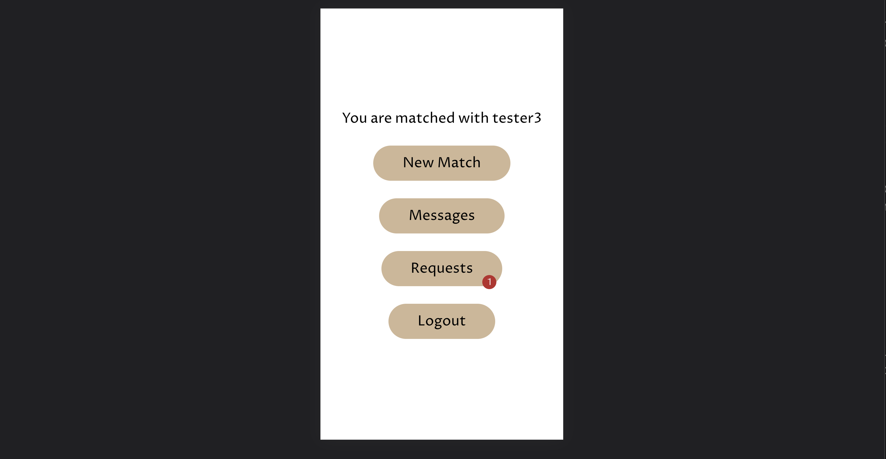
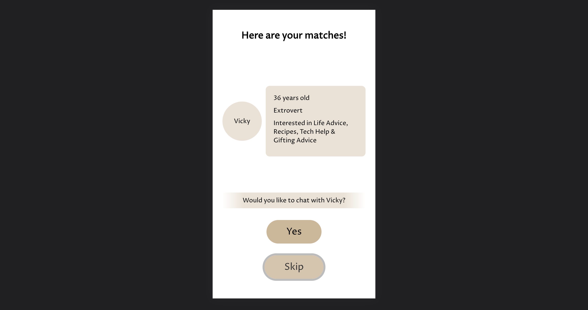
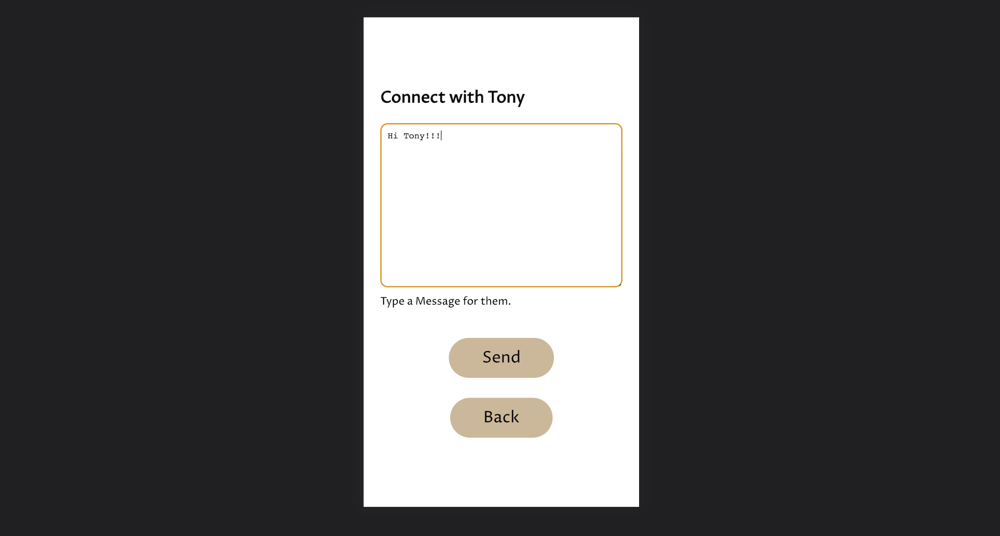
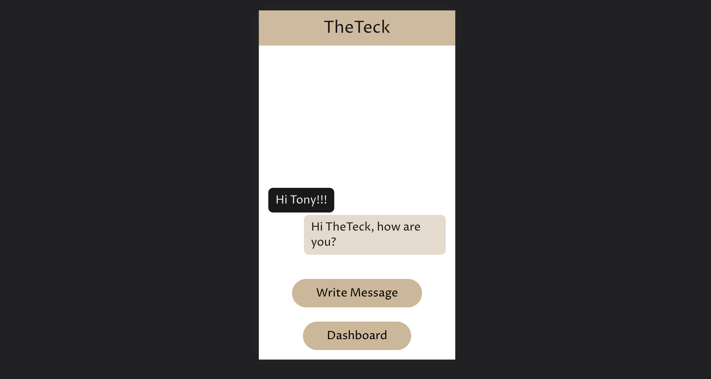
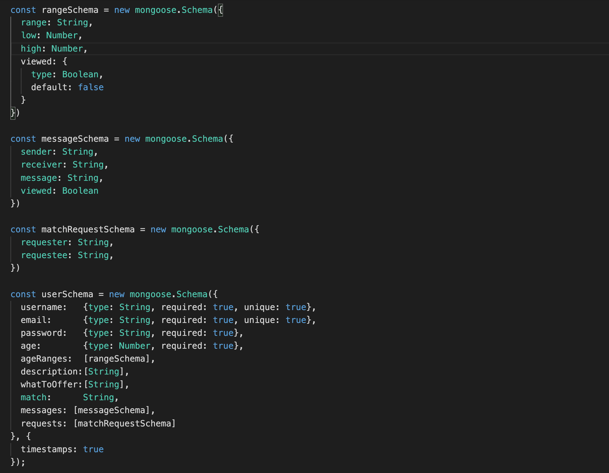

# Fireside

### Developed with **React**, **Node**, **Express**, **MongoDB** and **Sass**

---

---

## Table Contents

- [Overview](#overview)
- [Website](#website)
- [Features](#features)
  - [Onboarding](#onboarding)
  - [Dashboard](#dashboard)
  - [Finding a Match](#finding-a-match)
  - [Messaging](#messaging)
- [Code](#code)
  - [User Model](#user-model)

---

---

## Overview

---

_Fireside_ is an application created with the intention to bridge the age gap and create intergenerational friendships.

_Fireside_ started as a hackathon project and our objective was to bring together various generations, who are matched with the 'opposite' age group, in order to help one another. Baby boomers and beyond can get help from the younger generation for whatever they require, including but not limited to platonic companionship, gift ideas and so on. In return, the younger generation may recieve life advice or the satisfaction and knowledge that they've done a good deed, while also fufilling their need for companionship.

It was developed with the mobile user in mind, but it is responsively designed and will display nicely on larger screens.

---

---

## Website

Check out Fireside
[here](https://fireside-connect.herokuapp.com/)

---

---

## Features

---

### _Onboarding_:

  
The onboarding process is broken up into multiple pages, so as not to overwhelm the user. The first page will get the user's username, email and password.
  
The second onboarding page will get the user's age via a scroll wheel selector.
  
The third page is where the user may select the age groups they are interested in connecting with.
  
The fourth page is where the user can select the things that they can offer other users. The fifth page, much like the fourth, is where they select descriptors of themselves.

---

### _Dashboard_:

  
The dashboard, or the main menu, is where the user can see who they are connected with and buttons that will take them to pages to find new matches, view and write messages, view user requests and logout. If there are any unviewed requests or messages, it will be indicated on the appropriate button.

---

### _Finding A Match_:

  
The user can skip through all of the matching users. On each matching user, their name, age, description and what they have to offer is displayed. Upon the selection of a matched user, a connection request is sent to them.

When that user views the new request, the display is exactly like the matching user screen with the user's summary. Upon acceptance of the request, both users are then exclusively connected to each other and they can start messaging.

---

### _Messaging_:

  
The writing of a message is moved to it's own page to make it easier for more elderly users. Upon the creation of a message, the user is sent back to the view messages page, which looks like the standard text message app.

---

---

## Code

---

### _User Model_:

This app only uses one main model schema, the user schema, which has smaller nested model schemas.
